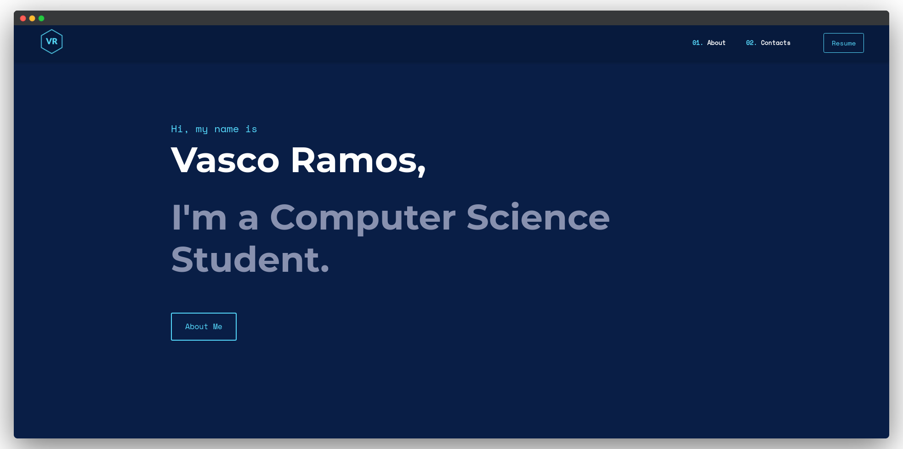

# Personal Portfolio Website 💻 🔥 [](https://github.com/vascoalramos/portfolio/blob/master/LICENSE.md)  [](https://lgtm.com/projects/g/vascoalramos/portfolio/context:javascript)

I developed this project because of the urge I felt to have a more accurate online representation of the work I do as a student of Computer Science and Junior Engineer.

Furthermore, I also used this idea/project to learn new skills, mainly in frontend development, such as [GatsbyJS](https://www.gatsbyjs.org/) and [React](https://reactjs.org/) and also tools and APIs like [GraphQL](https://graphql.org/).

I am, most definitely proud of what I was able to achieve, so, this is the product of all my learning of that technologies and the main purpose of this project is not only to serve as the git repository of my portfolio but also to share and showcase some of the things that I've learned these last few weeks all of you who may be interested.

Thanks for stopping by! 😉

## Getting Started 🚀

These instructions will get you a copy of the project up and running on your local machine for development and testing purposes. See deployment for notes on how to deploy the project on a live system.

### Prerequisites 📋

- [Git](https://git-scm.com)
- [Node.js](https://nodejs.org/en/download) (which comes with [npm](http://npmjs.com)) installed on your computer
- [Gatsby CLI](https://www.gatsbyjs.org/docs/quick-start)

The version of each prerequisite should be the following:

```bash
node@v10.16.0 or higher
npm@6.9.0 or higher
git@2.17.1 or higher
gatsby-cli@2.8.22 or higher
```

### How To Use 🔧

From your command line, clone and run Portfolio:

```bash
# Clone this repository
$ git clone https://github.com/vascoalramos/portfolio

# Go into the repository
$ cd portfolio

# Remove current origin repository
$ git remote remove origin

# Install dependencies
$ npm install

# Start development server
$ npm run develop
```

❗️ NOTE: ❗️ If you run into issues installing the dependencies, use the following commands:

```bash
# Install dependencies with all permissions
$ sudo npm install --unsafe-perm=true --allow-root

# Start development server
$ npm run develop
```

## Deployment 📦

Once you have done your setup, you need to put your website online!

What I chose was [Namecheap](https://namecheap.com) to the domain and DNS and [GitHub Pages](https://pages.github.com) to run my website!

Using the script I provide in [package.json](package.json) (I'm assuming your repo is already linked to your local folder and you have a gh-pages branch created), the only thing you have to do is to run the following command:

```bash
# Generate a full static production build
# and commit this build to your gh-pages branch
$ npm run deploy
```

Another option is to integrate the deployment of your Gatsby website with GitHub Actions via [Gatsby Publish](https://github.com/marketplace/actions/gatsby-publish).

You can check my web portfolio live at: [vascoalramos.me](https://vascoalramos.me)



## Technologies Used 🛠️

- [Gatsby](https://www.gatsbyjs.org/) - Static Site Generator
- [GraphQL](https://graphql.org/) - Query language for APIs
- [Markdown](https://www.markdownguide.org/) - Data Source
- [React](https://es.reactjs.org/) - Front-End JavaScript library
- [Bootstrap 4](https://getbootstrap.com/docs/4.3/getting-started/introduction) - Front-End UI library

## Author

- **Vasco Ramos:** [vascoalramos](https://github.com/vascoalramos)

## License 📄

This project is licensed under the MIT License - see the [LICENSE](LICENSE) file for details.

## Acknowledgments 🎁

- I built my portfolio based on a customised gatsby starter from [cobidev](https://github.com/cobidev) named [gatsby-simplefolio](https://github.com/cobidev/gatsby-simplefolio)
- I draw a lot of design inspiration from [Brittany Chiang](https://github.com/bchiang7) 4th version of her portfolio, which can be found [here](https://brittanychiang.com)

## Forking This Repo 🚨

During the development of this project, some people have asked me if they could use this code for their own websites.
The answer was always "yes", as long as it was some attribution. For business projects or otherwise something greater than just a personal project, that is not always the case. Thus, if in doubt, please don't think twice about asking me.

I most certainly value keeping this site open source, but as you all know, plagiarism is bad. Therefore, if you want to use this code to your website or as the baseline to a personal project, all I ask is to not claim this effort as your own.

So, feel free to fork this repo. If you do, please just give me proper credit by linking back to my website, [vascoalramos.me](https://vascoalramos.me). Refer to this handy [quora post](https://www.quora.com/Is-it-bad-to-copy-other-peoples-code) if you're not sure what to do. Thanks!
