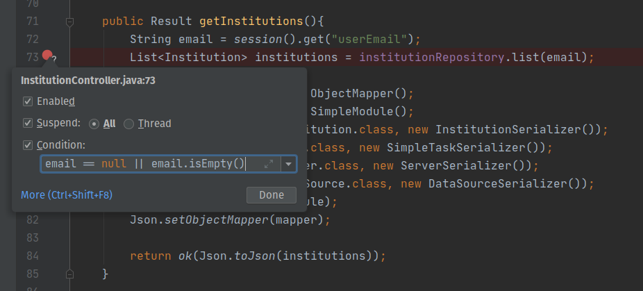

Recently, while working on a Java project with [IEETA Bioinformatics - UA](http://bioinformatics.ua.pt), I needed to do some serious debugging in the code. As I was new to the project and didn't have a strong knowledge of the project's codebase, I decided to use the Java debugger to inspect the behavior of the code and better understand the flow where the specific bug was occurring. That too was a challenge because I had never used a debugger.

Hence, I decided to write this article to help other programmers that, like I, are beginners at proper debugging and also to help me structure the knowledge I have recently learned.

**NOTE:** This article uses visual examples from [IntelliJ IDEA](https://www.jetbrains.com/idea), but the same concepts can be found and applied across most alternative JAVA IDEs.

## Breakpoints

A breakpoint allows you to specify where the program should stop when debugging so you can analyze the state of the program (inspect existing fields and variables, change its values, and more) and find what is wrong with your code.

Every debugger offers several types of breakpoints such as:

- **Line breakpoints:** Halt the program upon reaching the line of code where the breakpoint was set.
- **Method breakpoints:** Halt the program upon entering (or exiting) the specified method. This allows you to check the entry or exit conditions of a particular method.
- **Conditional breakpoints:** Halt the program when a certain criterion (condition) is met
- **Exception breakpoints:** Halt the program when `Throwable` or its subclasses are thrown.
- **Watch points:** Halt the program when the specified field is read or written to.

Here is an example of a condition breakpoint on the IntelliJ IDE, set on line number 73.

In addition to setting breakpoints, you can also **remove**, **mute**, **enable** and **disable** them. Mute a breakpoint is extremely helpful when you don't need to stop at some specific breakpoint for a while. Another helpful possibility is to enable/disable breakpoints, which is useful because when you delete a breakpoint, its internal configuration is lost, so enabling/disabling breakpoints it's a less terminal operation that allows you to temporarily turn an individual breakpoint off without losing its parameters.

## Step Actions

Every Java debugger provides a set of features (stepping actions) that allow you to navigate through different sections of your code when debugging, including:

- **Step Over:** Steps over the current line and takes you to the next line, even id the current line has method calls in it (the implementation of the methods is skipped).
- **Step Into:** Steps into the method to inspect what happens inside it.
- **Force Step Into:** Steps in the method even if this method is skipped by the regular Step Into.
- **Step Out:** Steps out of the current method and takes you to the caller method.
- **Drop Frame:** Allows you to undo the last frame and restore the previous frame in the stack. This can be useful if you've mistakenly stepped too far, or want to re-enter a function where you missed a critical spot.
- **Step Filter:** Allows you to skip certain packages during debugging. You don’t have to navigate through all classes of the JDK system when you can simply filter out types you don’t need.

## Variables Pane

Although the inline debugger is very helpful, the variables pane show a lot more details. With its help, you can see the exact state and value of each variable in the selected stack and can even change the value of those variables, if you need to better understand what effect a specific change in your variable has in the execution of your code.

## Wrap Up

Finally, remember that debugging might sometimes take more time than the actual implementation. As you improve your Java debugging skills, always try to write clean, efficient code - it makes a huge difference when it comes to debugging.

When you do need to do some debugging, remember that you only need to have to be creative and use the right tools.

And even with the right tools, when things seem to get out of hand, it’s always worth taking a break. A bug is nothing more than a programming puzzle, and sometimes you just need a break from the code to solve the bug.
