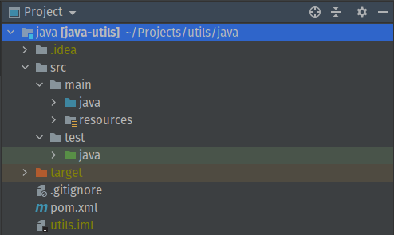
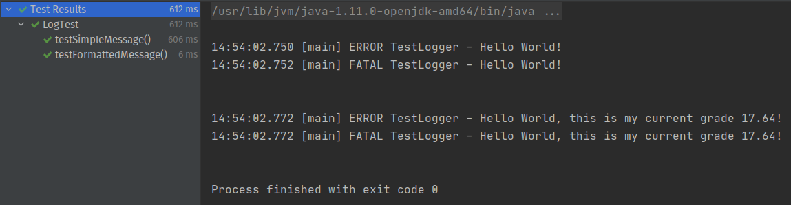

When I started my journey in computer science 3 years ago as a CS undergraduate student, I began to learn the basics of programming in python (attribution statements, conditions, loops, functions, recursion, others). Then, I moved to Java with OOP (Object-Oriented Programming) and, during all that time, I never used logging to debugging or monitoring purposes... I would always use print statements. Only if I knew better, it would have saved me a lot of time.

Before going to implementation details, I will give a quick overview of logging and its _levels_.

## Logging Levels

The most common levels in logging frameworks are **Debug**, **Info**, **Warn**, **Error** and **Fatal**.

### Debug

This is usually the most verbose log level. It allows you to understand the core code execution path in certain important processes. As the name implies, these messages help debug tasks since it allows us to trace what's going on in the code.

### Info

This level is usually used to highlight when something has happened. It's active by default, as opposed to Debug. It's usually used as an "assertion" that everything is operating smoothly, and since this messages use to contain little notes related to performed actions, at the end of the day, info messages are, essentially, just noise.

### Warn

It's used to report harmful situations that aren't relevant enough to require immediate action and can be fixed later.

### Error

At ERROR level, are logged error events that might still allow the application to continue running, but still, require immediate or close to immediate response.

### Fatal

As stated in [Tutorials Point](https://www.tutorialspoint.com/log4j/log4j_logging_levels.htm), Fatal-level messages are used to report very severe error events that will presumably lead the application to abort.

## Java Logging

Passed the overview, let's get started with Java logging. When you are finished reading, you will know how to approach logging in your Java source code, and better yet, how to learn and approach a new library in the scope of your project.

### Assumptions

For the sake of focus and simplicity, I'm going to use [IntelliJ IDEA](https://www.jetbrains.com/idea) and I'm also going to assume that you already have the [Java JDK](https://www.oracle.com/java/technologies/javase/javase-jdk8-downloads.html) installed on your machine.

I am going to use a simple "dummy" project to explain logging in java, but you can include this code and config directly into your project.

My project structure looks like this:



### Using a Logging Framework

In this tutorial, I'm going to use [Apache Log4j 2](https://logging.apache.org/log4j/2.x) because it is a widely used framework and I quite like it, but there are a bunch of other Java Logging Frameworks (see more [here](https://www.loggly.com/ultimate-guide/java-logging-basics)).

In this project, I am using Maven so, to add log4j to the project, I need to add the following XML to my `pom.xml`:

```xml
<dependency>
   <groupId>org.apache.logging.log4j</groupId>
   <artifactId>log4j-api</artifactId>
   <version>2.13.3</version>
</dependency>
<dependency>
   <groupId>org.apache.logging.log4j</groupId>
   <artifactId>log4j-core</artifactId>
   <version>2.13.3</version>
</dependency>
```

### Configuring the Logger (a different approach)

This bit is where I present to you a different approach from so many others logging config tutorials. Following the line of thought from Robert C. Martin in [Clean Code](https://www.goodreads.com/book/show/3735293-clean-code), I decided to explain the learning and configuration process of a third-party library through learning testing. As the author elaborates in the book, using learning tests to approach third-party code that is going to be introduced into your project is a good practice because:

- You can test the library capabilities and specificities in a controlled environment with a series of objective and precise experiments.
- The tests you write in this learning process are a good tool to test new releases of the third-party package, where you can easily see if something changed which enables you to make an informed decision whether to upgrade the package version or not.

That being said, our journey begins. The first step is to add testing capabilities to our project. To do so, we need to add this XML to `pom.xml` (I'm going to use JUnit 5):

```xml
<dependency>
   <groupId>org.junit.jupiter</groupId>
   <artifactId>junit-jupiter-api</artifactId>
   <version>5.6.2</version>
   <scope>test</scope>
</dependency>
<dependency>
   <groupId>org.junit.jupiter</groupId>
   <artifactId>junit-jupiter-engine</artifactId>
   <version>5.6.2</version>
   <scope>test</scope>
</dependency>
```

#### Testing Default Behaviour

Next, without configuring anything, we will test our third-party package (log4j). The tests I wrote are fairly simple but are enough to test the basic capabilities of our logging framework.

```java
public class LogTest {
    private Logger logger;

    @BeforeEach
    public void init() {
        logger = LogManager.getLogger("TestLogger");
    }

    @Test
    void testSimpleMessage() {
        String message = "Hello World!";

        logger.trace(message);
        logger.debug(message);
        logger.info(message);
        logger.warn(message);
        logger.error(message);
        logger.fatal(message);
    }

    @Test
    void testFormattedMessage() {
        String formattedMessage = "Hello {}, this is my current grade {}!";
        String word = "World";
        double grade = 17.64;

        logger.trace(formattedMessage, word, grade);
        logger.debug(formattedMessage, word, grade);
        logger.info(formattedMessage, word, grade);
        logger.warn(formattedMessage, word, grade);
        logger.error(formattedMessage, word, grade);
        logger.fatal(formattedMessage, word, grade);
    }
}
```

These tests are not going to fail, instead, they are going to show us what is the default behaviour of our logger.



The output implies the format that is being used and what is the upper level that is enabled by default (`ERROR`).

#### Configuration

First, go to "Project" tool window in IntelliJ and expand the folders till you locate the "resources" folder (java -> src -> main), just like in the image I showed earlier.

Now, create a file name `log4j2.properties` inside that folder.

After the file is created, insert the following specifications in the file:

```properties
name = Log4j2PropertiesConfig

appenders = console

# configuration of console logging
appender.console.type = Console
appender.console.name = STDOUT
appender.console.layout.type = PatternLayout
appender.console.layout.pattern = %highlight{%-21d{yyyy-MM-dd HH:mm:ss} %-12c %-8level %m%n}

# default root logging config
rootLogger.level = debug
rootLogger.appendRefs = stdout
rootLogger.appenderRef.stdout.ref = STDOUT
```

When you insert these configurations, the result of re-running the tests is the one you can see below:


Some detail:

- `name`: just specifies the name of that specific configuration layout.
- `appenders`: the name of the different **appender** components (the ones that effectively writes the message to some medium).
- The remaining configuration follows the same line of thought and for more detail see [here](https://logging.apache.org/log4j/log4j-2.2/manual/configuration.html).

## Happy Learning!

What I've tried to show you today is just an over-simplified introduction to the path of understanding logging usage and configuration with **log4j2**. If you want, there is a lot more to learn!

Here are some suggestions on what you can do:

- Learn how to have multiple appenders, each with a different type of output (console, file, etc).
- Learn how to configure different loggers, one for each log level.
- Play with the options available for the "layout" entry.
- Learn about the other ways you can configure log4j.

Furthermore, as I said, there are lots of options for logging frameworks; when you feel confident enough with log4j, try some of them.
